# Terraform GitHub Repository Module

<div class="grid cards" markdown>

-   :material-rocket-launch:{ .lg .middle } __Quick Start__

    ---

    Get up and running with the module in minutes

    [:octicons-arrow-right-24: Getting Started](getting-started/installation.md)

-   :material-shield-check:{ .lg .middle } __Security First__

    ---

    Built-in security scanning, compliance, and governance

    [:octicons-arrow-right-24: Security Features](user-guide/security-features.md)

-   :material-book-open:{ .lg .middle } __Examples__

    ---

    Real-world usage examples for every scenario

    [:octicons-arrow-right-24: View Examples](examples/basic.md)

-   :material-api:{ .lg .middle } __API Reference__

    ---

    Complete documentation of inputs, outputs, and resources

    [:octicons-arrow-right-24: API Docs](api/inputs.md)

</div>

## Overview

The **Terraform GitHub Repository Module** is a comprehensive solution for managing GitHub repositories with enterprise-grade security, compliance, and DevOps automation.

!!! info "Latest Version"
    [](https://registry.terraform.io/modules/kpeacocke/terraform-github-repo/latest)

### Key Features

- **GitFlow Enforcement** - Automatic branch protection with required status checks
- **Security Scanning** - Integrated CodeQL analysis and secret scanning  
- **Dependency Management** - Automated Dependabot with auto-merge capabilities
- **Compliance Ready** - SOC2, ISO27001, and enterprise governance features
- **Template Bootstrap** - Auto-generates standard files (README, LICENSE, SECURITY.md)
- **Policy Enforcement** - Open Policy Agent integration for custom compliance rules

### Architecture Overview

```mermaid
graph TB
    A[Terraform Module] --> B[GitHub Repository]
    B --> C[Branch Protection]
    B --> D[Security Features]
    B --> E[Automation]
    
    C --> C1[Main Branch]
    C --> C2[Release Branches]
    C --> C3[Required Checks]
    
    D --> D1[CodeQL Scanning]
    D --> D2[Secret Scanning]
    D --> D3[Dependabot]
    
    E --> E1[Auto-merge]
    E --> E2[PR Templates] 
    E --> E3[Issue Templates]
    
    style A fill:#623CE4
    style B fill:#24292e
    style C fill:#28a745
    style D fill:#dc3545
    style E fill:#ffc107
```



## Quick Example

```hcl title="main.tf"
module "github_repo" {
  source = "kpeacocke/terraform-github-repo/github"
  
  name       = "my-secure-repo"
  owners     = ["@security-team"]
  visibility = "private"
  
  # Security & Compliance
  enforce_gitflow   = true
  enforce_security  = true  
  enable_codeql     = true
  enable_dependabot = true
  
  # Automation
  allow_auto_merge = true
  enable_dependabot_autoapprove = true
}
```

## What's New

!!! tip "Latest Updates"
    - ✅ Enhanced CodeQL custom queries
    - ✅ Improved Dependabot auto-merge logic
    - ✅ New compliance reporting features
    - ✅ Advanced policy enforcement

## Support

<div class="grid cards" markdown>

-   :material-chat:{ .lg .middle } __Community Support__

    ---

    Get help from the community

    [:octicons-arrow-right-24: Discussions](https://github.com/kpeacocke/terraform-github-repo/discussions)

-   :material-bug:{ .lg .middle } __Report Issues__

    ---

    Found a bug? Report it here

    [:octicons-arrow-right-24: Issues](https://github.com/kpeacocke/terraform-github-repo/issues)

-   :material-email:{ .lg .middle } __Enterprise Support__

    ---

    Professional support available

    [:octicons-arrow-right-24: Contact Us](mailto:kpeacocke@users.noreply.github.com)

</div>
